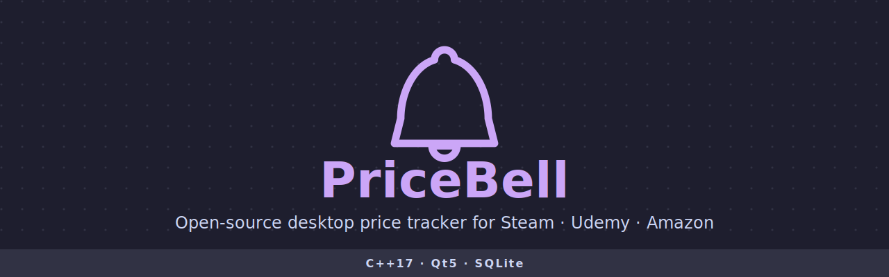

<p align="center">
  
</p>

# PriceBell

A desktop price tracking application that monitors product prices across Steam, Udemy, Amazon, and custom sources. Get notified when prices drop below your thresholds or discounts reach your targets.

Built with C++17 and Qt5. Runs on Linux, macOS, and Windows.

## Features

- **Multi-source tracking** -- Monitor prices from Steam, Udemy, Amazon, and user-configured sources
- **Alert conditions** -- Set price and discount thresholds with AND logic (all conditions must be met)
- **Desktop notifications** -- System tray alerts when conditions are triggered
- **Alert history** -- Review and dismiss past alerts
- **Background polling** -- Per-product check intervals from 30 seconds to 24 hours
- **Plugin system** -- Extend with native C++ plugins (.so/.dll) or JSON-configured sources
- **Dark theme** -- Catppuccin Mocha palette applied by default
- **System tray** -- Minimizes to tray on close, runs in background
- **SQLite persistence** -- Products, conditions, and alert history stored locally
- **Internationalization** -- English, Arabic (RTL), and French translations

## Quick Start

```bash
git clone https://github.com/Abdulkhalek-1/PriceBell.git
cd PriceBell
mkdir build && cd build
cmake ..
make -j$(nproc)
./PriceBell
```

See [docs/BUILDING.md](docs/BUILDING.md) for prerequisites and platform-specific instructions.

## Usage

1. **Add a product** -- Click "+ Add Product", enter the name, URL, source, alert conditions, and check interval
2. **Monitor** -- The app polls prices in the background and updates the product table
3. **Get notified** -- When alert conditions are met, a tray notification appears and the table row highlights
4. **Review alerts** -- Open Alert History to see triggered alerts and dismiss them
5. **Configure** -- Use Settings to enter API credentials (Udemy, Amazon), adjust polling defaults, and set the plugin directory

See [docs/USER_GUIDE.md](docs/USER_GUIDE.md) for the full walkthrough.

## Documentation

| Document | Description |
| -------- | ----------- |
| [Building](docs/BUILDING.md) | Prerequisites, build steps, running tests |
| [Architecture](docs/ARCHITECTURE.md) | System design, data flow, SQLite schema, plugin system |
| [User Guide](docs/USER_GUIDE.md) | Installation, adding products, alerts, settings |
| [Plugins](docs/PLUGINS.md) | Native plugin and JSON config source development |
| [Handlers](docs/HANDLERS.md) | How to add a new built-in price handler |
| [Contributing](CONTRIBUTING.md) | Code style, PR workflow, testing |

## Project Structure

```text
PriceBell/
├── include/
│   ├── core/           # Business logic (PriceChecker, AlertManager, PricePoller, PluginManager)
│   ├── handlers/       # Price source handlers (Steam, Udemy, Amazon, Generic)
│   ├── storage/        # SQLite persistence (Database, ProductRepository, AlertRepository)
│   ├── gui/            # Qt UI components (MainWindow, ProductDialog, SettingsDialog, TrayIcon)
│   └── utils/          # Logger, HttpClient
├── src/                # Implementation files (mirrors include/ structure)
├── tests/              # Test suite (PriceChecker, Repository)
├── assets/             # Logo, tray icons, dark theme stylesheet
├── i18n/               # Translation files (.ts)
├── docs/               # Documentation
└── CMakeLists.txt
```

## License

This project is licensed under the MIT License. See [LICENSE](LICENSE) for details.
